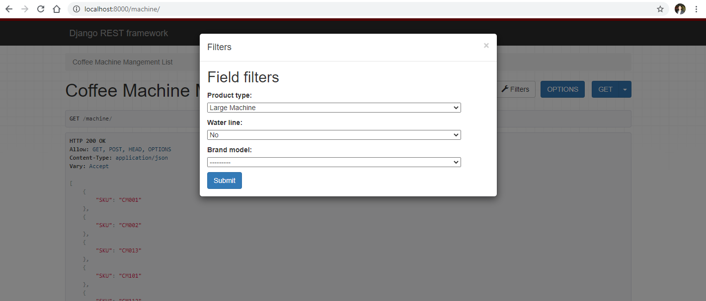
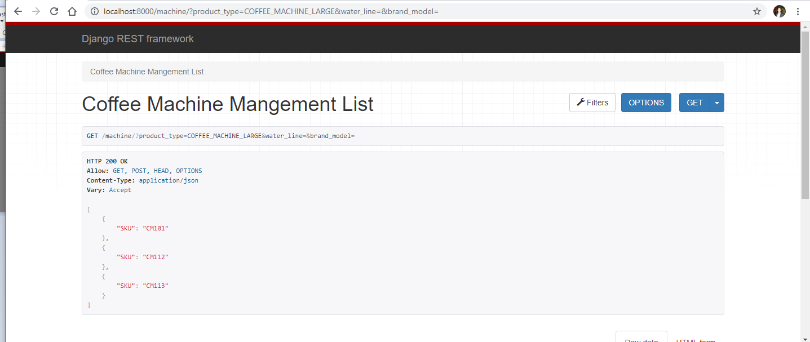

# Coffee Supplies Store
A client is building an e-commerce mobile application for their line of coffee machines and custom coffee pods; they are
looking to have two screens: one screen to display coffee machines and one screen to display coffee pods. On the coffee
machines screen, the user may filter by product type and water line. On the coffee pods screen, the user may filter by product
type, coffee flavor, and pack size. Your task is to simulate this environment and build an API to return the data for these two
screens.
## FUNCTION IMPLEMENTATION
Building a mongo DB and REST API with endpoints that return the JSON data for the coffee machines and coffee pods screens.
These endpoints should be filterable by product type, water line, coffee flavor, and pack size, depending on whether the
product is a coffee machine or coffee pod. For example, when filtering for large coffee machines, the endpoint should return an
array with CM101, CM102, and CM103 as JSON objects.

## Getting Started

### Installing Dependencies

#### Python 3.7

Follow instructions to install the latest version of python for your platform in the [python docs](https://docs.python.org/3/using/unix.html#getting-and-installing-the-latest-version-of-python)

#### Virtual Enviornment

It is recommended working within a virtual environment whenever using Python for projects. This keeps your dependencies for each project separate and organaized. Instructions for setting up a virual enviornment for your platform can be found in the [python docs](https://packaging.python.org/guides/installing-using-pip-and-virtual-environments/)

#### Virtualenv Quick Start
In your project folder run the following commands in your terminal
```bash
$ virtualenv env
$ source env/Scripts/activate
```

#### PIP Dependencies

Once you have your virtual environment setup and running, install dependencies by naviging to the `coffee-supplies-store\coffee_supplies` directory and running:

```bash
$ pip install -r requirements.txt
```

This will install all of the required packages selected within the `requirements.txt` file.

## Database Setup
With MongoDB running, create a database and and populate it with inital data using the `db_data.json` file provided. From the `\coffee_supplies` folder in terminal run:
```bash
$ python manage.py migrate
$ python manage.py loaddata db_data.json
```
## Running the server locally

From within the `\coffee_supplies` directory first ensure you are working using your created virtual environment.

To run the server, execute:

```bash
$ python manage.py runserver
```
The server will be running on 
`http://localhost:8000`

## Endpoints
|All Endpoints | Methods|
|---|---|
|`'/machine/'`|`GET` `POST`|
|`'/machine/<int:id>'`| `GET` `PUT` `PATCH` `DELETE`|
|`'/pod/'`|`GET` `POST`|
|`'/pod/<int:id>'`| `GET` `PUT` `PATCH` `DELETE`|
|---|---|

## Some Endpoints Examples

`GET '/machine/'`

- Fetches the SKU (Stock Keeping Unit) representation for the coffee machines.
- Allows filtering using: product_type, brand_model or/and water_line
- Request Arguments: None, product_type, brand_model or/and water_line

### Example Request
The request is filtered for Large Coffee Machines
```
http://localhost:8000/machine/?product_type=COFFEE_MACHINE_LARGE&water_line=&brand_model=
```
#### Response
>```
>[
>    {
>        "SKU": "CM101"
>    },
>    {
>        "SKU": "CM112"
>    },
>    {
>        "SKU": "CM113"
>    }
>]
>```
### Example Request using Django REST framework GUI 
You Can specify any filter using the `Filters` on the top right.



### Example Respone using Django REST framework GUI 



`POST '/machine/'`

- Adds a new coffee machine to the database
- Returns a JSON object containg the newly created data.

### Example Request
#### The request body
>```
>{
>    "product_type": "COFFEE_MACHINE_SMALL",
>    "brand_model": "BASE_MODEL",
>    "water_line": false
>}
>```
#### Response
>```
>{
>    "id": 1,
>    "product_type": "COFFEE_MACHINE_SMALL",
>    "brand_model": "BASE_MODEL",
>    "water_line": false
>}
>```


## Note:
    The django secret key is left on purpose to make it easier to run on different environments